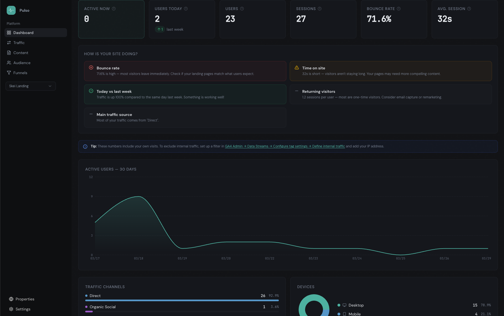

# Pulso



GA4 Dashboard SaaS for agencies and freelancers. Built with Laravel 12, Inertia.js v2, React 19, shadcn/ui, and Tailwind CSS v4.

## Requirements

- PHP 8.2+
- MySQL 8.0+
- Node.js 20+
- Composer

## Installation

```bash
composer install
npm install
cp .env.example .env
php artisan key:generate
php artisan migrate
```

## Development

```bash
# Start all services
composer run dev

# Or separately
php artisan serve --port=8002
npm run dev
```

## Docker

Run the app with Docker Compose (includes MySQL 8.0):

```bash
# Build and start
docker compose up -d
```

The app will be available at `http://localhost:8123`.

You can set the database password via environment variable:

```bash
DB_PASSWORD=mypassword docker compose up -d
```

Data is persisted in Docker volumes (`mysql-data` for the database, `app-storage` for uploads/logs). The app container includes Nginx, PHP-FPM, queue worker, and scheduler.

To stop:
```bash
docker compose down        # keeps data
docker compose down -v     # removes data volumes
```

## Google Cloud Console Setup

### 1. Create a Google Cloud Project

- Go to [console.cloud.google.com](https://console.cloud.google.com)
- Create a new project (e.g. "Pulso")

### 2. Enable Required APIs

Enable **both** APIs. You can use the direct links below (replace `YOUR_PROJECT_ID` with your numeric project ID) or find them in APIs & Services > Library:

| API | Purpose | Direct Enable Link |
|-----|---------|-------------------|
| **Google Analytics Data API** | Fetch reports, metrics, realtime data | `https://console.developers.google.com/apis/api/analyticsdata.googleapis.com/overview?project=YOUR_PROJECT_ID` |
| **Google Analytics Admin API** | List accessible GA4 properties | `https://console.developers.google.com/apis/api/analyticsadmin.googleapis.com/overview?project=YOUR_PROJECT_ID` |

> **Important:** Both APIs must be enabled. The Admin API is needed to list properties, the Data API is needed to fetch analytics data. If either is missing you'll get a 403 "SERVICE_DISABLED" error. After enabling, wait 1-2 minutes for propagation.

### 3. Configure OAuth Consent Screen

Go to APIs & Services > OAuth consent screen:

- **User Type:** External
- **App name:** Pulso
- **Scopes** — add these two:

| Scope | Purpose |
|-------|---------|
| `https://www.googleapis.com/auth/analytics.readonly` | Read GA4 report data |
| `https://www.googleapis.com/auth/analytics.edit` | Read property list from Admin API (read-only despite the name) |

- **Test users:** Add any Gmail accounts that will use the app during development

### 4. Create OAuth Credentials

Go to APIs & Services > Credentials > Create Credentials > OAuth Client ID:

- **Application type:** Web application
- **Authorized redirect URIs:**

```
http://127.0.0.1:8002/auth/google/callback
http://localhost:8002/auth/google/callback
http://localhost:8123/auth/google/callback
```

> **Note:** Add both `127.0.0.1` and `localhost` variants. For Docker, use port `8123`. For local dev, use port `8002`. The port must match your `APP_URL` in `.env`.

Copy the **Client ID** and **Client Secret**.

### 5. Save Credentials in the App

Credentials are stored in the database, not in `.env`:

1. Log in to the app
2. Go to **Settings > Google**
3. Enter Client ID and Client Secret
4. Click Save
5. Click **Connect Google Account**

## Environment Variables

Google credentials are managed via the admin UI. The only GA-related `.env` values are cache TTLs:

```env
# Cache TTL in seconds
GA_CACHE_TTL_CORE=3600        # 1 hour for standard reports
GA_CACHE_TTL_REALTIME=60      # 1 minute for realtime
GA_CACHE_TTL_FUNNEL=7200      # 2 hours for funnel reports
```

## Testing

```bash
# Run all tests
php artisan test

# Run specific test file
php artisan test --filter=DashboardTest

# Run with compact output
php artisan test --compact
```

## Code Style

```bash
# Format PHP files
vendor/bin/pint

# Format only changed files
vendor/bin/pint --dirty
```
